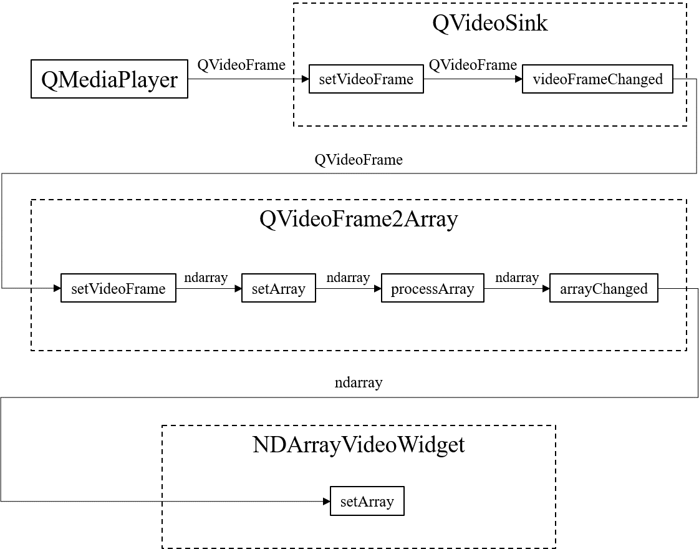

Python package to display video in GUI using `OpenCV-Python` and `PySide6`.

# Introduction

cv2PySide6 is a package which provides utility classes and functions that integrate `cv2` and `PySide6`.

With cv2PySide6, you can build pipeline which reads video with `PySide6`, converts the frame to `numpy` array for processing with `cv2`, and casts it back to `PySide6` object.

# Installation

Before you install, be careful for other Qt-dependent packages installed in your environment.
For example, non-headless `OpenCV-Python` module modifies the Qt dependency thus making PySide6 unavailable.

For quick install, run the following command.
This directly installs `cv2PySide6` from the repository using `pip`.

```
$ pip install git+https://github.com/JSS95/cv2PySide6.git
```

You can specify the version after an `@` at the end of the url.
The following command installs `cv2PySide6` with version `v1.0.0`.

```
$ pip install git+https://github.com/JSS95/cv2PySide6.git@v1.0.0
```

# How to use

1. Subclass `QVideoFrame2Array` to define image processor with custom `processArray` method.
2. Set the video sink of `QMediaPlayer` as frame source of the processor.
3. Set the image processor as array source of `NDArrayVideoWidget`.

In `PySide6`, video frames are acquired as `QVideoFrame` and passed from `QMediaPlayer` to `QVideoSink`, then to `QVideoWidget`.

<div align="center">
  <br>
    Video display pipeline in PySide6
</div>

In `cv2PySide6`, `QVideoFrame2Array` comes after `QVideoSink`.
This converts the `QVideoFrame` to `numpy.ndarray`, process it, then pass to `NDArrayVideoWidget`.
You can subclass `QVideoFrame2Array` and override `processArray` with your own image processing.

<div align="center">
  <br>
    Video display pipeline in cv2PySide6
</div>

Use cases are provided in [examples](cv2PySide6/examples) directory.
